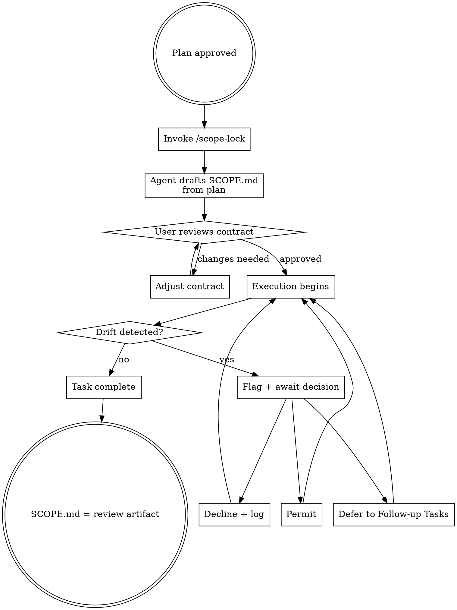

# Scope Lock — Design Spec
**Date:** 2026-03-14
**Status:** Draft

---

## Overview

Scope Lock is a Claude Code skill that complements the SuperPowers front-loaded planning workflow with back-loaded enforcement. After a plan is approved, Scope Lock generates a boundary contract, presents it for user review, and then governs the execution phase — flagging scope changes, logging every decision, and deferring out-of-scope work to a follow-up task list.

The skill serves a dual purpose: it disciplines the agent against opportunistic drift, and it gives the user a deliberate self-regulation checkpoint against their own impulse to expand scope mid-task.

---

## Problem Statement

AI-assisted development has a structural drift problem. Models are trained to be helpful, and "helpful" frequently means fixing adjacent things, refactoring code encountered while working, or adding features that feel obviously related. This drift happens silently — the agent just does more — and by the time the user notices, the conversation has already expanded beyond the original intent.

This is compounded when the user themselves introduces scope expansions mid-task, often without realizing it. A spec that was clearly bounded at planning time gradually inflates through a series of small, individually-reasonable decisions.

Scope Lock makes these decisions explicit, visible, and reviewable.

---

## Design Decisions

### Enforcement Style
**Soft enforcement with explicit escalation** — not hard blocking.

Skills are text injected into context; they cannot technically prevent operations the way a linter or pre-commit hook can. Enforcement is behavioral: the skill makes the agent pause, name the potential drift, and surface a decision rather than silently proceeding or refusing.

### Drift Response
**A + C: Skip and log, keep moving.**

When a scope change is declined, the agent does not stop execution. It logs the event and continues with in-scope work. If the declined item represents real work that needs doing, it lands in the Follow-up Tasks section for the user to schedule separately.

### Contract Generation
**Collaborative draft (agent proposes, user approves).**

The agent reads the approved plan and drafts the Scope Contract. The user reviews before execution begins. This review step is a deliberate self-regulation checkpoint — an opportunity to consciously decide "am I okay with adjacent refactoring this time?" before committing to the boundary.

### User-Initiated Scope Expansion
**Soft flag only — note once, proceed on confirm.**

When the user introduces something new mid-task in the main conversation thread, the agent notes it once without full interruption, then proceeds if the user confirms. The event is logged regardless.

### /btw Channel
**No integration — by design.**

`/btw` (Claude Code v2.1.72, built-in) spawns ephemeral read-only agents whose interactions never enter conversation history. Scope Lock's jurisdiction is the main conversation thread, full stop. If an instruction never enters the main thread, it never changed scope. This is a coherent boundary, not a gap.

---

## The Living Document: `SCOPE.md`

One file, three sections, created once and updated throughout execution. This is the primary artifact of the skill.

### Structure

```markdown
# Scope Contract
**Task:** [plan title / reference]
**Date:** [YYYY-MM-DD]
**Status:** ACTIVE | CLOSED — [N scope changes logged, N follow-up tasks created]

## In Scope
- **Files:** [list from plan]
- **Features / Acceptance Criteria:** [from plan]
- **Explicit Boundaries:** [any constraints from brainstorming]

## Out of Scope (Explicit)
- [Items consciously excluded during planning]
- [Items added here via declined scope changes during execution]

---

# Scope Change Log

| # | Category | What | Why | Decision | Outcome |
|---|----------|------|-----|----------|---------|

---

# Follow-up Tasks
- [ ] [Description] — from scope change #N
```

### Scope Change Categories

| Category | Meaning |
|---|---|
| `dependency` | Touching an out-of-scope file is required to complete in-scope work |
| `emergent` | Implementation revealed the spec was incomplete |
| `opportunistic` | Agent noticed something fixable while already in the file |
| `ambiguity` | Spec wasn't specific enough to determine what's in or out |
| `user-expansion` | User introduced new work mid-task via main conversation thread |

---

## Flagging Behavior

### Agent-Initiated Drift (full flag)

When the agent detects it is about to touch something outside the contract:

```
⚠️ SCOPE CHECK
Category: opportunistic
What: Refactoring error handling in `api-client.ts` (not in contract)
Why: Current implementation will cause silent failures in the feature being built
Decision needed: Permit / Decline / Defer to Follow-up Tasks
```

The agent waits for the user's response before logging and continuing.

### User-Initiated Expansion (soft flag)

When the user introduces new work mid-task in the main thread:

```
↩️ SCOPE NOTE: "add dark mode" wasn't in the original contract.
Proceeding if confirmed — or I can log it as a follow-up task instead.
```

One line, non-blocking, logged regardless of decision.

---

## Workflow



---

## Integration Points

| Context | Behavior |
|---|---|
| After `writing-plans` | Natural handoff — agent reads the plan to draft the Scope Contract |
| With `executing-plans` | Scope Lock runs first; executing-plans operates within the established boundary |
| Standalone | Works without any SuperPowers skill — just needs a plan document or spec to read |
| `/btw` channel | No integration needed — ephemeral, read-only, cannot affect scope by design |

---

## Session Close

When the task is marked complete, the agent updates the contract header:

```markdown
**Status:** CLOSED — 3 scope changes logged, 1 follow-up task created
```

`SCOPE.md` becomes the review artifact: what was planned, what drifted, what was decided, what comes next.

---

## What This Skill Is Not

- **Not a hard gate.** It cannot prevent the agent from taking action the way a linter can. Enforcement is behavioral.
- **Not a replacement for good planning.** A high rate of `ambiguity` and `emergent` entries in the Scope Change Log is a signal that the brainstorming or plan-writing phase was incomplete — not that Scope Lock failed.
- **Not a punishment framework.** Permitted scope changes are as valid as declined ones. The log is a record of decisions, not a scorecard.

---

## Success Criteria

- Agent pauses and flags before touching out-of-scope files or adding unspecified features
- Every scope change event — permitted, declined, or deferred — appears in the Scope Change Log
- Declined items land in Follow-up Tasks, not lost in conversation history
- `SCOPE.md` at task close tells the complete story without requiring the user to scroll through the conversation
- The contract review step functions as a deliberate self-regulation checkpoint for the user
